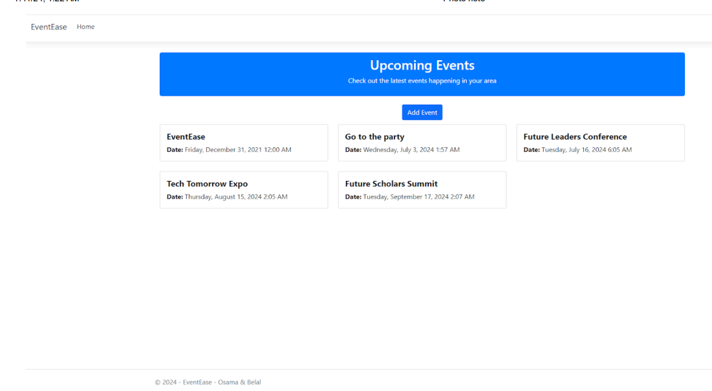

"# EventEase"  git init git add README.md git commit -m "first commit" git branch -M main git remote add origin https://github.com/osama-inv/EventEase.git git push -u origin main

"# EventEase" 
# Effortless Event Navigation: Your Smart Event Solution

> 

# introdution
- Many people find planning an event to be a daunting task. The stress of coordinating schedules, managing vendors, and keeping track of countless details can be overwhelming. This is where EventEase comes in - a comprehensive event planning app designed to simplify the process and make event organization a breeze.

- The core idea behind EventEase is to provide users with a centralized platform that streamlines every aspect of event planning. The app starts by guiding the user through a series of questions to understand the type of event, the number of guests, the desired location, and the overall budget. Based on this information, EventEase generates a customized timeline and to-do list, breaking down the planning process into manageable tasks.

# Key Features
## Event Wizard:
The app's intuitive Event Wizard guides users through the initial setup, gathering all the necessary information to create a personalized plan.
## Calendar Synchronization:
EventEase seamlessly integrates with popular calendar apps, allowing users to easily schedule and manage event-related tasks and appointments.
## Vendor Management:
The app provides a directory of trusted vendors, making it easy to research, compare, and book services such as catering, photography, and entertainment.
## Budget Tracking:
EventEase includes a comprehensive budgeting tool that helps users track expenses, stay within their budget, and identify potential cost-saving opportunities.
## Collaboration:
The app enables multiple users to collaborate on the same event, ensuring everyone is on the same page and can contribute to the planning process.
## Checklists and Reminders: 
EventEase generates detailed checklists and provides timely reminders to help users stay organized and on top of their planning tasks.

# Installation
EventEase is a web-based application, so there is no need for installation. Users can access the app directly using any modern web browser.

# Usage
## To use EventEase, simply follow these steps:

- Visit the EventEase website at www.eventease.com.
- Create an account or log in to your existing account.
- Use the Event Wizard to input details about your event, such as the type of event, the number of guests, the desired location, and the overall budget.
- Explore the app's features, including the calendar synchronization, vendor management, budget tracking, and collaboration tools.
- Utilize the checklists and reminders to stay organized and on top of your planning tasks.

# Contributing
We welcome contributions from the community to help improve EventEase. If you're interested in contributing, please follow these steps:

- Fork the repository on GitHub.
- Create a new branch for your feature or bug fix.
- Implement your changes and test them thoroughly.
- Submit a pull request with a detailed description of your changes.
Our team will review your contribution and provide feedback. If it's a good fit, we'll merge it into the main codebase.

# Related Projects
## PartyPlanner:
Another event planning app with a focus on party organization.
## VenueHub:
A platform for finding and booking event venues.
## CateringConnect:
An online marketplace for catering services.

# Licensing
- EventEase is licensed under the MIT License. Feel free to use, modify, and distribute the app as per the terms of the license.

# Authors
Belal EL_zaro - Frontend
Osama Mahmoud - Backend
